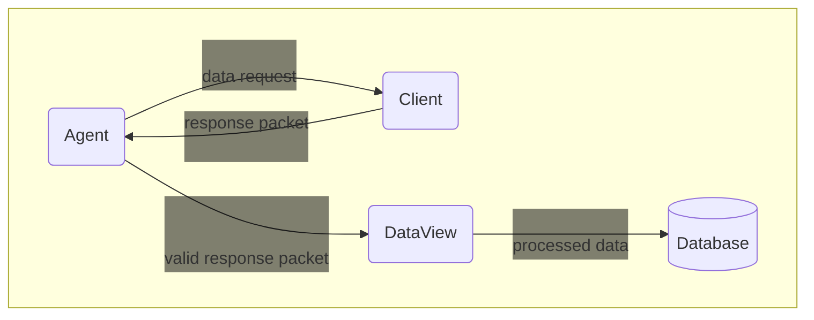
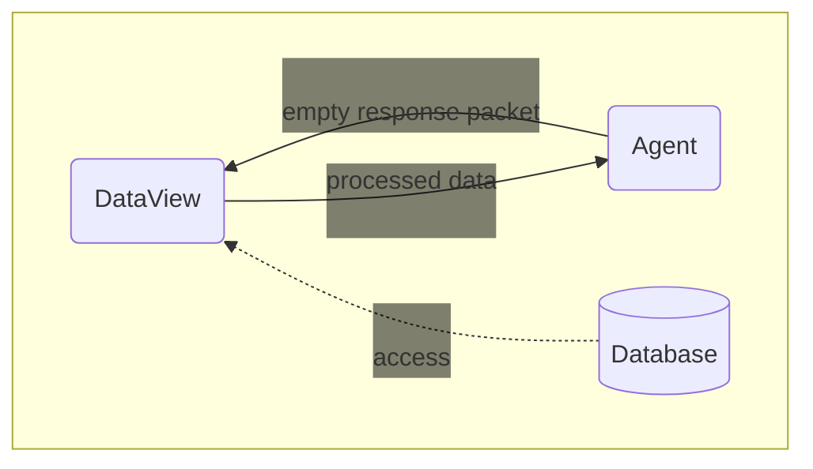
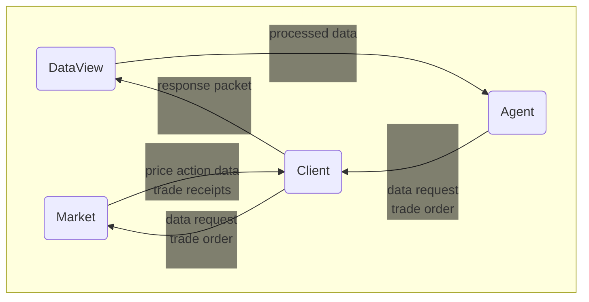
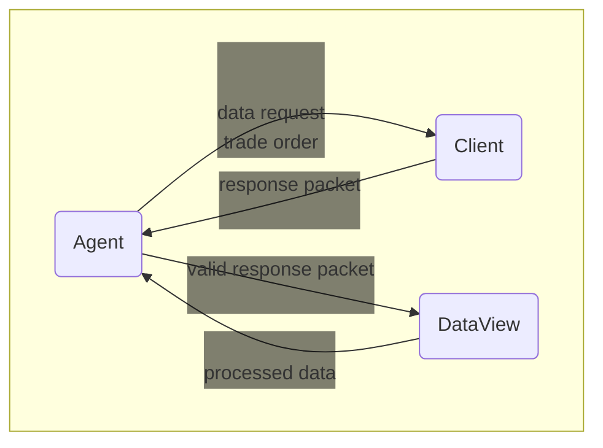
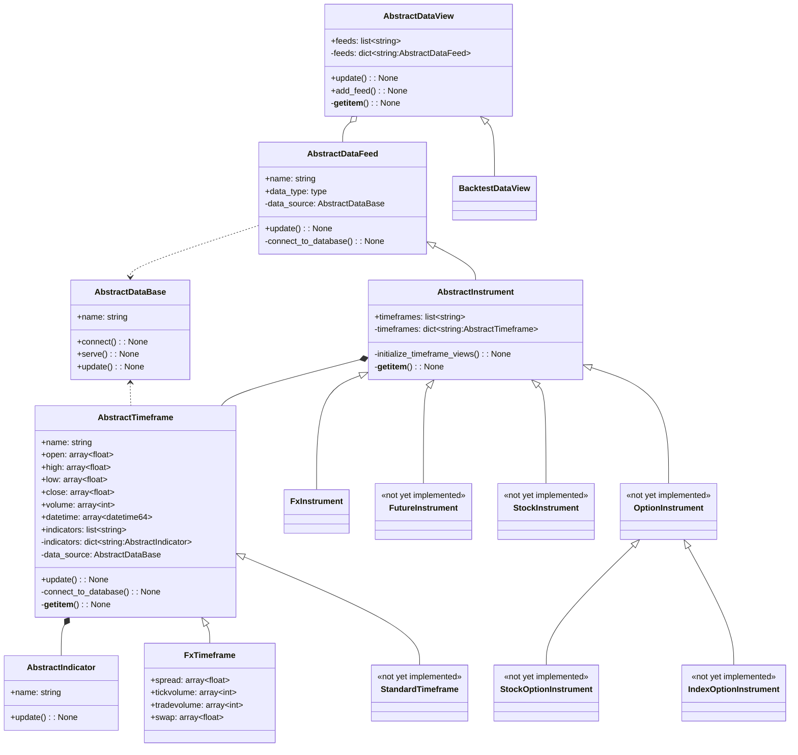

# marketresearch

This codebase contains tools to help market traders build trading strategies based on technical analysis. The following 
modules are currently included:

- clients: Contains code for interacting with various brokerage APIs.
- data: Contains untracked data files and the scripts for mining data from online services.

## Installation

0. After cloning, install anaconda on your machine.
0. In a terminal supporting anaconda commands, navigate on your local machine to this repo: 
`<path_to_repo>/marketresearch`
0. Install the conda environment by typing: `conda env create -f environment.yml`
0. Create the following untracked file: `marketresearch/marketresearch/clients/secrets.py`. This is where you should 
put credentials for online services. Alternatively, you can use this file as an interface to your credentials stored 
elsewhere on your machine.

## Use Cases
### Data Mining

### Backtesting

### Simulation

### Algorithmic Trading

## DataView Classes
